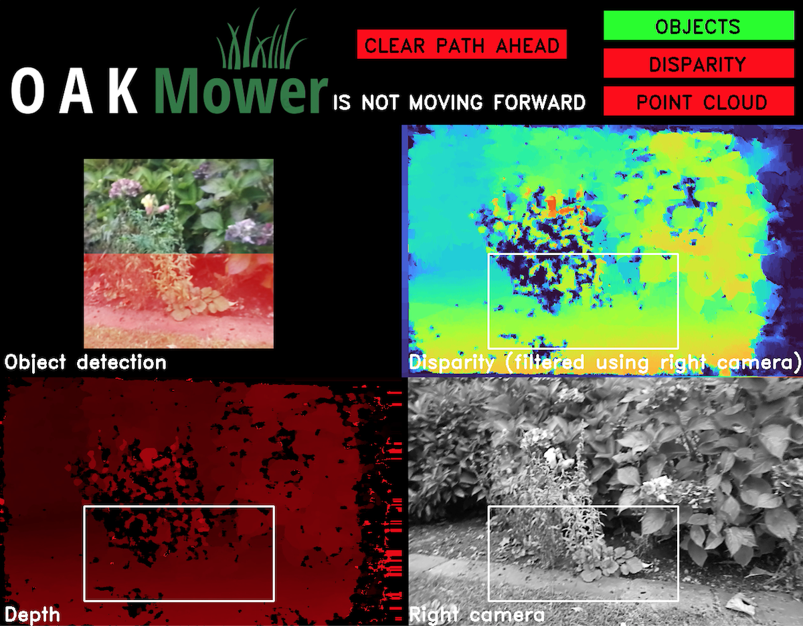
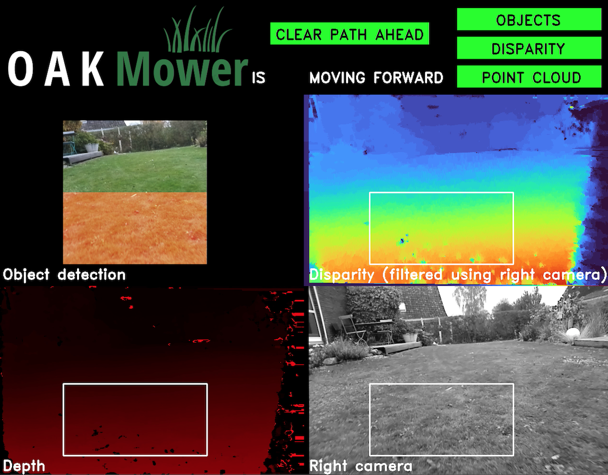

# OAKMower

[OpenCV Spatial AI Competition Phase 1](https://opencv.org/announcing-the-opencv-spatial-ai-competition-sponsored-by-intel-phase-1-winners/) finalist project "Automatic Lawn Mower Navigation" aiming to utilize [OAK-D](https://www.kickstarter.com/projects/opencv/opencv-ai-kit) to enable multi-modal obstacle and limit detection using object detection and depth estimation and classification simultaneously.
For detailed documentation check out the corresponding [page](https://alemamm.github.io/oakmower/).

# Samples

## Limit detected

## Clear path

## Object detected

# Installation
Simply clone or download the [DepthAI repository](https://github.com/luxonis/depthai) and follow the installation tutorial on the [Luxonis website](https://docs.luxonis.com).
Copy the files contained in this repository into the depthai repository and if you have been able to run the depthai_demo.py OAKMower should run as well. However, so far I have only performed tests on MacOS.
