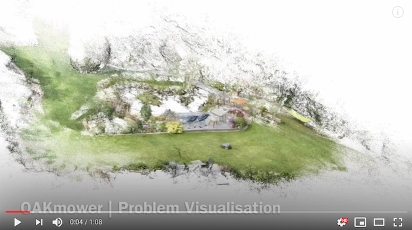
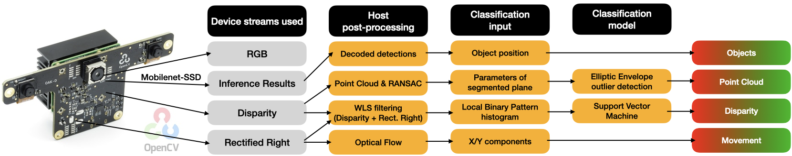

# Spatial AI for Limit and Obstacle Detection

## Problem statement
Lawn mowing is a time-consuming and tiring routine household task. In recent years it has become one of the main personal robot applications. But even high-end products still require the expensive installation of boundary wires to ensure that the robot stays on the lawn. However, even with sich wires limiting the lawn area, numerous problems can occur, including the bot
* killing small animals such as hedgehogs,
* hurting children, cats, dogs,
* driving into molehills and
* crashing into "unwired" obstacles such as trees.

Proper abstacle detection for mowing bots can save lives, money and the bot itself. The aim is to prove that this can be achieved using the OpenCV AI Kit with Depth (OAK-D).

## Problem description
Considering the importance of health and safety and the dangers posed by a lawn mower's cutting blades, any solution for limit and obstacle detection needs to be sufficiently robust. The most common approach today are boundary wires that need to be burried surrounding and thus limiting the lawn area. Any other obstacle is detected with contact sensors once the robot crashes into it. However, the robot will require some time to actually stop. If the obstacle is small, light or flat enough, the robot will not stop. As the number of lawn mower bots increases so do the stories about cut cattails, dead hedgehogs, etc. Click on the video below for an illustration of our bot's behaviour when encountering obstacles.

# Solution
Spatial AI allows for multimodal solutions. OAK-D makes Spatial AI and Embedded AI available for everyone. I tried to fully leverage the power and functionality of OAK-D using all sensors and functionalities simultaneously:
* Neural inference for object detection on Intel Movidius Myriad X and 4K RGB camera
* Point cloud classification based both mono cameras for disparity/depth streams
* Disparity image classification based on disparity and rectified right streams
* Motion estimation using ectified right stream

OAKMower uses three classifers:
* Point Cloud
* Disparity
* Objects

## Setup

## Point Cloud classification
#### Idea
The point cloud obtained if enough free space is left in front of the bot should contain a significant amount of points belonging to a plane. Parameters describing the position of that plane in space should be relatively constant, mainly influenced by uneven terrain and camera movement. More points contained in the plane should mean more free space and higher confidence.

#### Approach
The device does not allow for streaming both disparity and depth. Also, that would be a waste of bandwdith and frame rate as depth can be calculated from disparity as explained [in the DepthAI FAQs](https://docs.luxonis.com/faq/#how-do-i-calculate-depth-from-disparity). Using the intrinsics from the calibration files, [a point cloud can be calculated using Open3D.](https://github.com/luxonis/depthai-experiments/tree/master/point-cloud-projection) The [plane can be segmented surprisingly fast within few iterations of the RANSAC algorithm.](http://www.open3d.org/docs/release/python_api/open3d.geometry.PointCloud.html#open3d.geometry.PointCloud.segment_plane) This allows for real-time use on the host.

I used the parameters a, b, c and d

describing the plane as well as the amount of points considered as inliers of the plane as features to classify the point cloud as representing a clear path or obstacle. We can assume that the parameters of big clear path planes follow a normal distribution whereas obstacles can be considered outliers. Therefore, I decided to go for [anomaly detection algorithms.](https://scikit-learn.org/stable/modules/outlier_detection.html) for my point cloud classifier.

## Filtered Disparity classification

#### Idea
The disparity/depth data is noisy and largely influenced by oclusions. Even assuming that outlier filtering is applied successfully, it will not be possible to tell if a flat area in front belongs to the lawn or plaster. This texture information

This should give an overview of the solution. Use diagrams, flowcharts to explain the solution visually. If you reference papers, please provide links. 

# Results [3 - 4 pages]
Use as much space as you want to show as many results as you want. Link to generated videos if needed.  

# Limitations [ 1 -2 paragraphs ]
Conditions under which the solution does not work.

# Future work [0.5 - 1 page]
Things that you could not complete because of time, budget, or other constraints. 

# References [0.5  - 1 page ]
Acknowledge code you may have used from other repositories. Also, refer to papers you may have implemented. 
